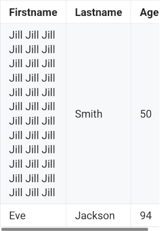
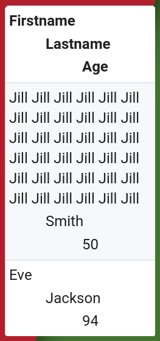

<h1 align="center"></h1>

Stop your website's tables from overflowing on mobile with this fancy tiny trick with CSS & Javascript

<a href="#why-should-i-care">Why?</a> ⋅ <a href="#how-does-this-work">How?</a> ⋅ <a href="#demo-pls">Demo pls?</a>

---

## Why (should I care)?

Tables are a great way of visualising data on a website and making sense of the clutter that countless data points and numbers tend to make.

Wikipedia, for example, tends to be quite full of tables, as are GitHub READMEs.
Most of these tables look like this:

When you view these tables on mobile, however, or on an otherwise really small screen, they tend to look like this:

The tables overflow horizontally!

This hinders readability, forces users to scroll horizontally, and generally makes the mobile table experience a nuisance, plus it is, in my opinion, pretty unaesthetic.
Horizontal scrollbars should be used as a last resort and not as the standard way of doing something, especially since 60% of website visitors are mobile users nowadays.

One solution I came up with (which this repository demonstrates) is to stack the table columns once the viewport gets so small the table tries to overflow, like this:

I think this is a really neat solution, and I don't get why no website I have ever seen does this (please feel free to correct me on this if you know any).

---

For this reason, I made this repository;
to showcase an example on how to achieve this, share some well-documented demonstration code that you can use or build on, explain said demonstration code (it's much less trivial than it looks), and host a working demonstration of it.

## How (does this work)?

## Demo pls?

### for looks:

I have hosted an example page with the example table from this README and another table with example images [here](https://phseiff.com/tiny-tables/demo).
 
You can visit it and resize it to see how the tables look on a large scale display vs on a tiny display (further instructions are on the demo page).

There is also an [anti-demo](https://phseiff.com/tiny-tables/anti-demo) that shows how that'd look without our tiny little trick.

### for code:

The code of the demos is in this repository, and licensed under MIT, so feel free to reuse it for your own website!
There is essentially one file `large-table-styling.css` which describes how the tables look by default (the style for tables that aren't at risk of overflowing), and in the file `demo.html`, you can find a full and well-documented implementation of the trick explained above.

---

ToDo:
* Note that you need to use `display: block` with your tables in order for this to work.