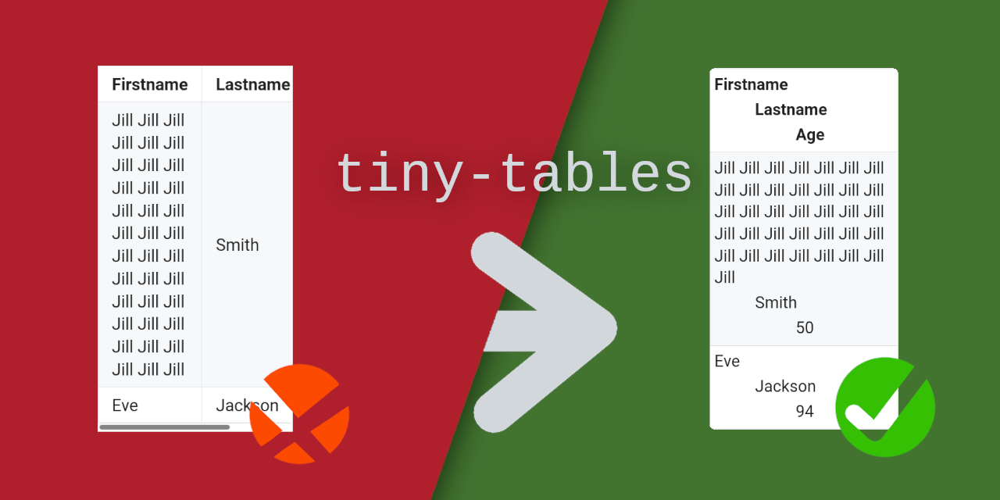
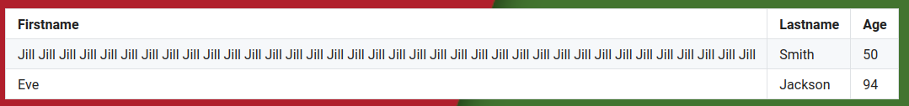
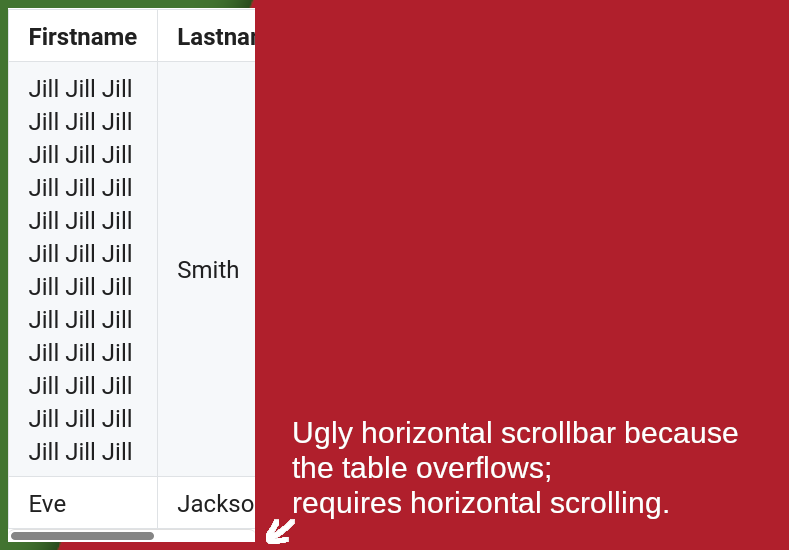
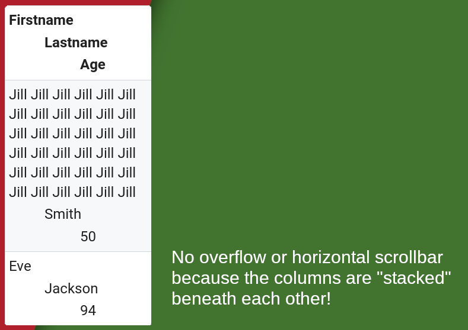

<h1 align="center"></h1>

<p align="center">Stop your website's tables from overflowing on mobile with this fancy tiny trick with CSS & Javascript</p>

<p align="center"><a href="#why-should-i-care">Why?</a> ⋅ <a href="#how-does-this-work">How?</a> ⋅ <a href="#demo-pls">Demo pls?</a> ⋅ <a href="#how-do-i-even-use-this">How to use this?</a></p>

---

## Why (should I care)?

I really like tables because they are a great way of visualising data on a website and making sense of the clutter that countless data points and numbers tend to make.

Wikipedia, for example, tends to be quite full of tables, as are GitHub READMEs.
Most of these tables look like this:



When you view these tables on mobile, however, or on an otherwise really small screen, they tend to look like this:



The tables overflow horizontally!

This hinders readability, forces users to scroll horizontally, and generally makes the mobile table experience a nuisance, plus it is, in my opinion, pretty unaesthetic.
Horizontal scrollbars should be used as a last resort and not as the standard way of doing something, especially since 60% of website visitors are mobile users nowadays.

One solution I came up with (which this repository demonstrates) is to stack the table columns once the viewport gets so small the table tries to overflow, like this:



I think this is a really neat solution, and I don't get why no website I have ever seen does this.

---

For this reason, I made this repository;
to showcase an example on how to achieve this, share some well-documented demonstration code that you can use or build on, explain said demonstration code (it's much less trivial than it looks), and host a working demonstration of it.

## How (does this work)?

Essentially, I wrote two solutions, one with javascript and CSS, and one in pure CSS.<br/>
The CSS solution is somewhat limited, whilst the javascript solution deactivates the CSS solution (only if javascript is enabled, of course) and replaces it with its own way of doing things.

I will look at both solutions separately in the following:

* *The pure CSS solution*:

  This uses some pretty simple CSS that re-styles all tables within a query that ensures it's only applied if `screen-size<600px`.<br/>
  This comes with the two disadvantages that (1) some tables might be large enough to overflow even if `screen-size>599px`, and (2) all column indents are hard-coded, which means that every field past the 7<sup>th</sup> field (or so) of a row is not indented at all, and that tables with more than 4 columns (or so) will overflow even with the extra style applied.

Both of these issues are fixed by the javascript-implementation.

* *The javascript+CSS solution*:

  This comes in two steps:

  1. As soon as the entire DOM is loaded (even before css and images finished loading), a custom CSS class is created for every table (not yet assigned to it, though).
     This CSS class describes how the table should look like on a screen on which it'd otherwise overflow, and it contains enough indention levels for all columns, and the indention widths are adjusted to the amount of columns the table has, to make sure no field is indented more than 90px.
   
     This solves issue (2) of the CSS-only solution.

  2. Every time the viewport is resized (and one time each after the DOM and the assets of the website are loaded), a function is called (by binding to `DOMContentLoaded`, `loaded` and `resize` events) that iterates over all tables of the document and assigns each one its minify-class (in case it overflows), and un-assigns it again (if doing so is possible without causing an overflow).<br/>
     The pure CSS solution is kept as an intermediate solution through all of this until all images are loaded (triggering the `load` event), to ensure that tables with images in them don't require horizontal scrolling until all images are loaded.

   This solves issue (1) of the CSS-only solution, and it does so pretty efficiently since it adds no overhead other than a function call *on resize* and two on page load (the call on `DOMContentLoaded`, in case you wondered, isn't really necessary, but it reduces the time until layout shift is finished for websites without text-only tables).

**In case you'd like to see how it looks like when the table switches to its mobile form, here is a GIF:**

<p align="center"></p>

**FAQ:**

<details id="many-images-info"><summary>But isn't iterating over all tables on every resize pretty cost-intensive?</summary>

It isn't, since all tables are added to an array on page load, so iterating over them goes in `O(num_tables)` rather than <code>O(dom_size<sup>2</sup>)</code> or something.</details>

<details><summary>What's the issue about tables with images? There's even one specifically in the demo!</summary>

There are actually two issues, to be precise.

1. Let's say you have a table which has at least one image in every row, and these images have `width: 100%` or `max-width: 100%` with no proper min width.
   The consequence is that these images will shrink and shrink and become ridiculously small when you reduce the screen width, and the table won't overflow (and switch into the small table styling) until at least one of these images has almost vanished.<br/>
   You want your tables to change into their mobile style *before* your images become ridiculously small, though.
   
   This is solved by adding some quick and dirty global

   ```css
   table img[max-width=100%] {
       max-width: none !important;
   }
   table img[width=100%] {
       width: none !important;
   }
   ```
   
   onto the page during the process of calculating whether a table overflows or not, invisibly to the user.

2. It sometimes takes a while until all images are loaded, and the images a table contains can be crucial for deciding whether it overflows or not.
   For this reason, the tables are checked for overflow both on DOM load as well as after all images have loaded.<br/>
   Since it can take a while from the first image overflowing a table, and the last image being loaded, the pure-CSS-solution remains active alongside the JS solution until all images have loaded, to err on the side of applying the tiny table styling until all images have loaded.</details>

## Demo pls?

### for looks:

I have hosted an example page with the example table from this README and another table with example images [here](https://phseiff.com/tiny-tables/demo).
<br/>
You can visit it and resize it to see how the tables look on a large scale display vs on a tiny display (further instructions are on the demo page).

There is also an [anti-demo](https://phseiff.com/tiny-tables/anti-demo) that shows how that'd look without our tiny little trick.

### for code:

The code of the demos is in this repository, and licensed under MIT, so feel free to reuse it for your own website!
There is essentially one file `large-table-styling.css` which describes how the tables look by default (the style for tables that aren't at risk of overflowing), and in the file `demo.html`, you can find a full and well-documented implementation of the trick explained above.

### How do I even use this?

If you use the same or a similar styling for tables as the one described in `large-table-styling.css`, you might be able to just copy the relevant code from `demo.html` (pretty much everything after the demos) into your HTML files.

If your default styling of tables is largely different, you might be able to do the same, but it will probably look somewhat odd, since the tables on mobile will give off a different vibes than they'd give off on desktop.
You can change the minified-table-CSS to suit your needs, though!

If your tables contain many images, you might want to tweek and double-check some things;
see [above](#many-images-info) for further information.<br/>
Please also note that tables need to use `display: block`, since their overflow won't be detected correctly otherwise.

---

I feel like this way of handling tables should be way more popular than it apparently is (please tell me if you know of any website that does somewhat similar, I'd love to see it!), and I hope you might find it useful, too - feel free to use its code, it's MIT licensed.

If you find this trick useful, please consider giving this repository a star :star: to show your appreciation! :D

ToDo:
* [x] Demo mobile optimizen
* [ ] die beiden Bilder extenden
* [ ] add browser resize gif
* [ ] make images for sharing
* [ ] (maybe) make texts for sharing