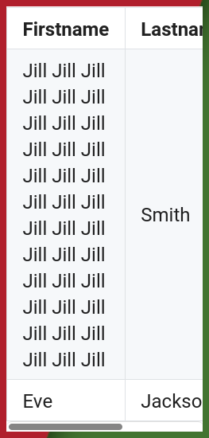

<h1 align="center"></h1>

Stop your website's tables from overflowing on mobile with this fancy tiny trick with CSS & Javascript

[ww](https://phseiff.com/)

---

## Why (should I care)?

Tables are a great way of visualising data on a website and making sense of the clutter that countless data points and numbers tend to make.

Wikipedia, for example, tends to be quite full of tables, as are GitHub READMEs.
Most of these tables look like this:

When you view these tables on mobile, however, or on an otherwise really small screen, they tend to look like this:

The tables overflow horizontally!

This hinders readability, forces users to scroll horizontally, and generally makes the mobile table experience a nuisance, plus it is, in my opinion, pretty unaesthetic.
Horizontal scrollbars should be used as a last resort and not as the standard way of doing something, especially since 60% of website visitors are mobile users nowadays.

One solution I came up with (which this repository demonstrates) is to stack the table columns once the viewport gets so small the table tries to overflow, like this:

I think this is a really neat solution, and I don't get why no website I have ever seen does this (please feel free to correct me on this if you know any).

---

ToDo:
* Note that you need to use `display: block` with your tables in order for this to work.